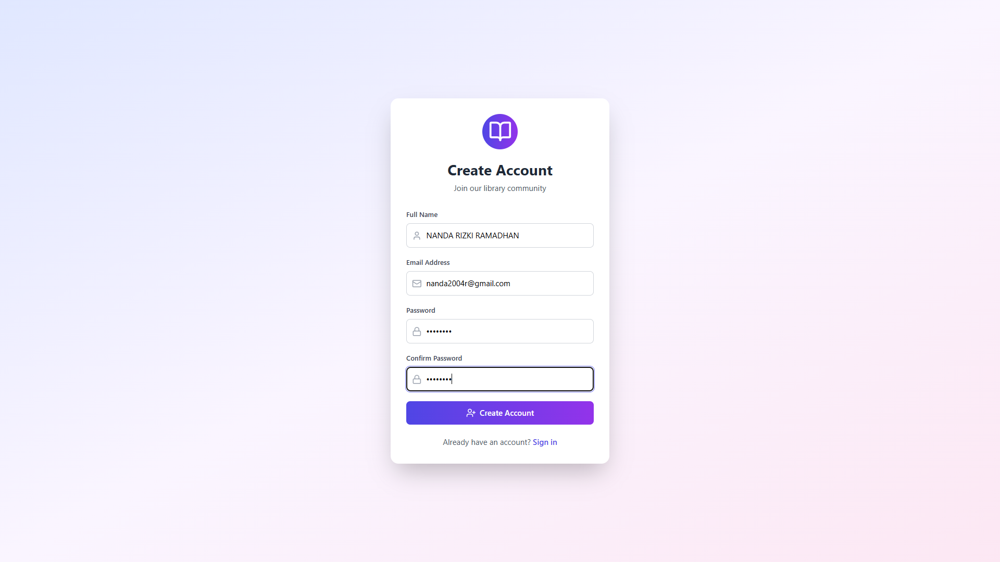
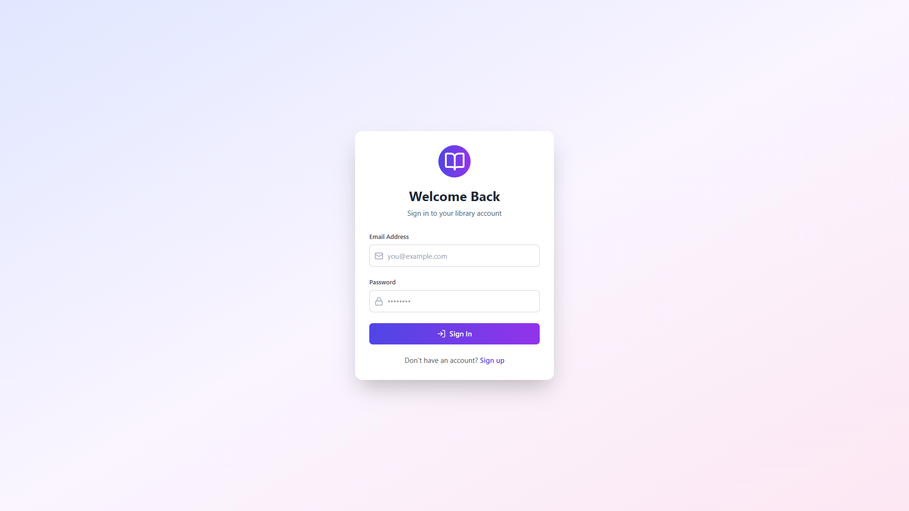
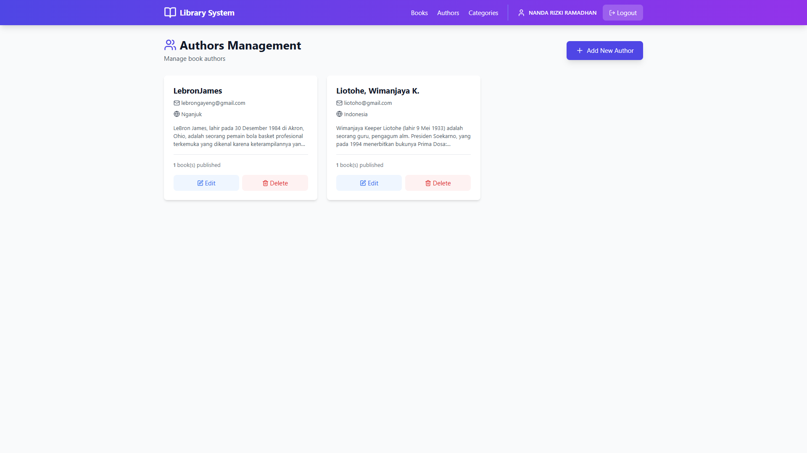
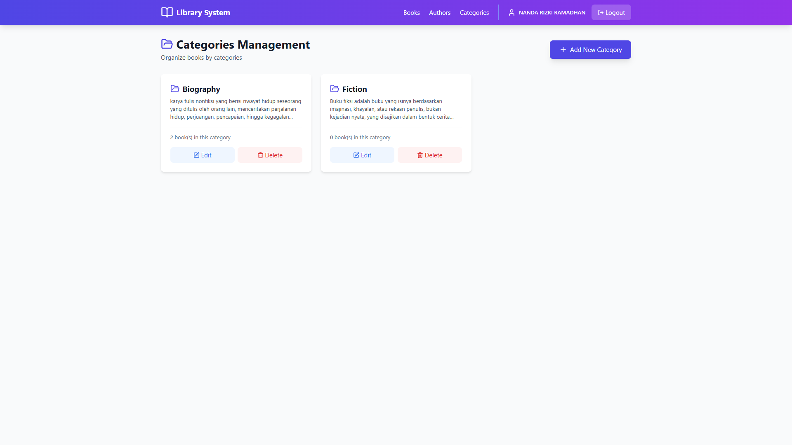
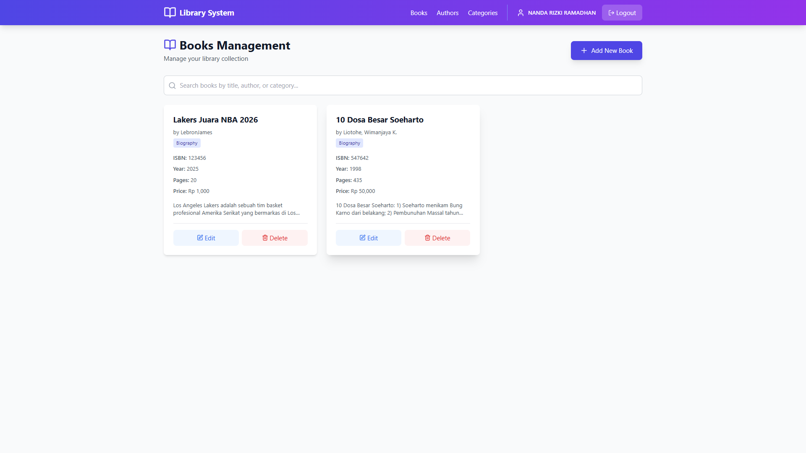

# 📚 LIBRARY MANAGEMENT SYSTEM

Sistem Manajemen Perpustakaan Digital - Full Stack Application

**Project Akhir Rekayasa Web**

---

## 👤 Identitas Mahasiswa
- **Nama:** NANDA RIZKI RAMADHAN
- **NIM:** G.211.23.0025
- **Mata Kuliah:** Rekayasa Web
- **Topik:** Full Stack CRUD Application dengan Laravel & React

---

## 📋 Deskripsi Project

Library Management System adalah aplikasi web full-stack untuk mengelola data perpustakaan yang mencakup manajemen buku, penulis, dan kategori buku. 

Aplikasi ini dibangun dengan:
- **Backend:** Laravel 11 REST API dengan Laravel Sanctum Authentication
- **Frontend:** React 18 dengan Vite, React Router, dan Tailwind CSS
- **Database:** MySQL dengan relasi antar tabel

---

## ✨ Fitur Utama

### 🔐 Authentication
- ✅ Register user baru
- ✅ Login dengan token-based authentication (Laravel Sanctum)
- ✅ Logout
- ✅ Protected routes (hanya user login yang bisa akses)

### ✍️ CRUD Authors (Kelola Penulis)
- ✅ Lihat daftar semua penulis
- ✅ Tambah penulis baru (Nama, Email, Country, Bio)
- ✅ Edit data penulis
- ✅ Hapus penulis (cascade delete ke books)
- ✅ Lihat jumlah buku per penulis

### 📂 CRUD Categories (Kelola Kategori)
- ✅ Lihat daftar semua kategori
- ✅ Tambah kategori baru (Nama, Deskripsi)
- ✅ Edit data kategori
- ✅ Hapus kategori (cascade delete ke books)
- ✅ Lihat jumlah buku per kategori

### 📖 CRUD Books (Kelola Buku)
- ✅ Lihat daftar semua buku dengan info author & category
- ✅ Tambah buku baru dengan relasi ke author & category
- ✅ Edit data buku
- ✅ Hapus buku
- ✅ Search buku berdasarkan title, author, atau category
- ✅ Validasi data lengkap

### 🎨 UI/UX
- ✅ Modern dan elegant design
- ✅ Responsive (mobile-friendly)
- ✅ Gradient colors (indigo-purple)
- ✅ Smooth animations dan transitions
- ✅ Loading states
- ✅ Form validation dengan feedback

---

## 🛠️ Tech Stack

### Backend (Laravel)
- **Laravel 11** - PHP Framework
- **Laravel Sanctum** - API Token Authentication
- **MySQL** - Relational Database
- **Eloquent ORM** - Database relationships
- **Composer** - Dependency management

### Frontend (React)
- **React 18** - JavaScript UI Library
- **Vite** - Build tool & dev server
- **React Router DOM** - Client-side routing
- **Axios** - HTTP client
- **Context API** - State management
- **Tailwind CSS** - Utility-first CSS
- **Lucide React** - Icon library

---

## 📊 Database Schema

### Relasi Antar Tabel:

```
users (1) ──── (many) personal_access_tokens
    ↓
   login

authors (1) ──── (many) books
categories (1) ──── (many) books

books (many) ──── (1) author
books (many) ──── (1) category
```

### Tabel Users
| Field | Type | Description |
|-------|------|-------------|
| id | bigint | Primary Key |
| name | string | Nama lengkap |
| email | string | Email (unique) |
| password | string | Password (hashed) |
| created_at | timestamp | Waktu dibuat |
| updated_at | timestamp | Waktu diupdate |

### Tabel Authors
| Field | Type | Description |
|-------|------|-------------|
| id | bigint | Primary Key |
| name | string | Nama penulis |
| email | string | Email (unique) |
| bio | text | Biografi |
| country | string | Negara asal |
| created_at | timestamp | Waktu dibuat |
| updated_at | timestamp | Waktu diupdate |

### Tabel Categories
| Field | Type | Description |
|-------|------|-------------|
| id | bigint | Primary Key |
| name | string | Nama kategori |
| description | text | Deskripsi |
| created_at | timestamp | Waktu dibuat |
| updated_at | timestamp | Waktu diupdate |

### Tabel Books
| Field | Type | Description |
|-------|------|-------------|
| id | bigint | Primary Key |
| title | string | Judul buku |
| isbn | string | ISBN (unique) |
| description | text | Deskripsi buku |
| published_year | integer | Tahun terbit |
| pages | integer | Jumlah halaman |
| price | decimal | Harga |
| author_id | bigint | Foreign Key (authors) |
| category_id | bigint | Foreign Key (categories) |
| created_at | timestamp | Waktu dibuat |
| updated_at | timestamp | Waktu diupdate |

---

## 📸 Screenshots

### 1. Halaman Register


User dapat membuat akun baru dengan memasukkan nama, email, dan password.

---

### 2. Halaman Login


User login menggunakan email dan password yang sudah terdaftar.

---

### 3. Halaman Authors


Mengelola data penulis buku dengan fitur CRUD lengkap. Menampilkan nama, email, country, bio, dan jumlah buku yang ditulis.

---

### 4. Halaman Categories


Mengelola kategori buku dengan fitur CRUD lengkap. Menampilkan nama kategori, deskripsi, dan jumlah buku dalam kategori.

---

### 5. Halaman Books


Mengelola data buku dengan fitur CRUD lengkap dan search. Menampilkan judul, ISBN, author, category, tahun terbit, jumlah halaman, harga, dan deskripsi. Buku dapat dicari berdasarkan judul, author, atau category.

---

## 🚀 Instalasi & Setup

### Prasyarat
- PHP >= 8.1
- Composer
- Node.js >= 16
- MySQL/MariaDB

### 1. Clone Repository

```bash
git clone https://github.com/[USERNAME-ANDA]/library-management-system.git
cd library-management-system
```

### 2. Setup Backend

```bash
cd backend

# Install dependencies
composer install

# Copy environment file
cp .env.example .env

# Generate application key
php artisan key:generate

# Konfigurasi database di .env
# DB_DATABASE=library_db
# DB_USERNAME=root
# DB_PASSWORD=

# Buat database
mysql -u root -e "CREATE DATABASE library_db"

# Jalankan migration
php artisan migrate

# Jalankan server (port 8000)
php artisan serve
```

Backend berjalan di: **http://localhost:8000**

### 3. Setup Frontend

Buka terminal baru (jangan tutup terminal backend):

```bash
cd frontend

# Install dependencies
npm install

# Jalankan development server (port 5173)
npm run dev
```

Frontend berjalan di: **http://localhost:5173**

---

## 📖 Cara Penggunaan

### Alur Penggunaan Aplikasi:

#### 1️⃣ Register & Login
1. Buka browser: `http://localhost:5173`
2. Klik "Sign up" untuk membuat akun
3. Isi form registrasi (Nama, Email, Password)
4. Setelah berhasil, otomatis login

#### 2️⃣ Tambah Categories (Wajib Duluan!)
1. Klik menu "Categories"
2. Klik "Add New Category"
3. Isi nama kategori (contoh: Fiction, Science, Biography)
4. Isi deskripsi
5. Klik "Create Category"
6. Ulangi untuk beberapa kategori

#### 3️⃣ Tambah Authors (Wajib Kedua!)
1. Klik menu "Authors"
2. Klik "Add New Author"
3. Isi data penulis (Nama, Email, Country, Bio)
4. Klik "Create Author"
5. Ulangi untuk beberapa penulis

#### 4️⃣ Tambah Books
1. Klik menu "Books"
2. Klik "Add New Book"
3. Isi semua data buku:
   - Title, ISBN, Description
   - Published Year, Pages, Price
   - Pilih Author dari dropdown
   - Pilih Category dari dropdown
4. Klik "Create Book"

#### 5️⃣ Kelola Data
- **Edit:** Klik tombol "Edit" pada card item
- **Delete:** Klik tombol "Delete" pada card item
- **Search:** Gunakan search bar di halaman Books

#### 6️⃣ Logout
- Klik tombol "Logout" di navbar

---

## 🔌 API Documentation

### Base URL
```
http://localhost:8000/api
```

### Authentication

#### Register
```http
POST /api/register
Content-Type: application/json

{
  "name": "John Doe",
  "email": "john@example.com",
  "password": "password123",
  "password_confirmation": "password123"
}
```

#### Login
```http
POST /api/login
Content-Type: application/json

{
  "email": "john@example.com",
  "password": "password123"
}
```

Response:
```json
{
  "access_token": "1|xxxxxxxxxxxxxx",
  "token_type": "Bearer",
  "user": { ... }
}
```

#### Logout
```http
POST /api/logout
Authorization: Bearer {token}
```

### Authors Endpoints

```http
GET    /api/authors              # Get all authors
GET    /api/authors/{id}         # Get author by ID
POST   /api/authors              # Create author
PUT    /api/authors/{id}         # Update author
DELETE /api/authors/{id}         # Delete author
```

### Categories Endpoints

```http
GET    /api/categories           # Get all categories
GET    /api/categories/{id}      # Get category by ID
POST   /api/categories           # Create category
PUT    /api/categories/{id}      # Update category
DELETE /api/categories/{id}      # Delete category
```

### Books Endpoints

```http
GET    /api/books                # Get all books (with author & category)
GET    /api/books/{id}           # Get book by ID
POST   /api/books                # Create book
PUT    /api/books/{id}           # Update book
DELETE /api/books/{id}           # Delete book
```

**Note:** Semua endpoint kecuali register & login membutuhkan authentication token.

---

## 📁 Struktur Project

```
library-management-system/
│
├── README.md                     ← Dokumentasi utama
├── screenshots/                  ← Screenshot aplikasi
│   ├── register.png
│   ├── login.png
│   ├── authors.png
│   ├── categories.png
│   └── books.png
│
├── backend/                      ← Laravel Backend
│   ├── app/
│   │   ├── Http/
│   │   │   └── Controllers/
│   │   │       ├── AuthController.php
│   │   │       ├── AuthorController.php
│   │   │       ├── CategoryController.php
│   │   │       └── BookController.php
│   │   └── Models/
│   │       ├── User.php
│   │       ├── Author.php
│   │       ├── Category.php
│   │       └── Book.php
│   ├── database/
│   │   └── migrations/
│   ├── routes/
│   │   └── api.php
│   ├── config/
│   │   └── cors.php
│   ├── .env.example
│   └── composer.json
│
└── frontend/                     ← React Frontend
    ├── src/
    │   ├── components/
    │   │   ├── Navbar.jsx
    │   │   └── ProtectedRoute.jsx
    │   ├── pages/
    │   │   ├── Login.jsx
    │   │   ├── Register.jsx
    │   │   ├── Books.jsx
    │   │   ├── Authors.jsx
    │   │   └── Categories.jsx
    │   ├── services/
    │   │   └── api.js
    │   ├── context/
    │   │   └── AuthContext.jsx
    │   ├── App.jsx
    │   └── main.jsx
    ├── public/
    ├── index.html
    └── package.json
```

---

## 🔒 Security Features

1. **Password Hashing** - Bcrypt encryption
2. **Token Authentication** - Laravel Sanctum
3. **Protected Routes** - Token verification
4. **CORS Configuration** - Allowed origins only
5. **Input Validation** - Server-side validation
6. **SQL Injection Prevention** - Eloquent ORM

---

## 🐛 Troubleshooting

### Backend tidak bisa diakses
```bash
# Pastikan server running
php artisan serve

# Clear cache
php artisan config:clear
php artisan cache:clear
```

### Frontend error CORS
```bash
# Cek config/cors.php di backend
# Pastikan ada 'http://localhost:5173'
# Restart Laravel server
```

### Migration error
```bash
# Drop semua tabel dan migrate ulang
php artisan migrate:fresh
```

### Token authentication error
```bash
# Pastikan HasApiTokens ada di User model
# Pastikan migration personal_access_tokens sudah jalan
php artisan migrate
```

---

## 📚 Referensi

- [Laravel 11 Documentation](https://laravel.com/docs/11.x)
- [Laravel Sanctum](https://laravel.com/docs/11.x/sanctum)
- [React Documentation](https://react.dev/)
- [React Router](https://reactrouter.com/)
- [Tailwind CSS](https://tailwindcss.com/)
- [Axios](https://axios-http.com/)

---

## ✅ Kriteria Project Terpenuhi

| No | Kriteria | Status |
|----|----------|--------|
| 1 | Proyek individu | ✅ |
| 2 | CRUD API dengan Laravel | ✅ |
| 3 | Authentikasi (Sanctum) | ✅ |
| 4 | 3 Tabel dengan relasi | ✅ Authors, Categories, Books |
| 5 | Frontend React JS | ✅ |
| 6 | Tampilan elegant | ✅ Modern UI dengan Tailwind |
| 7 | Fungsional penuh | ✅ Semua CRUD berfungsi |
| 8 | Upload GitHub | ✅ |
| 9 | Video presentasi | ✅ |
| 10 | Kreativitas | ✅ Search, animations, responsive |

---

## 📝 Testing

### Manual Testing Checklist

Backend:
- ✅ Register user baru via Postman
- ✅ Login dan dapatkan token
- ✅ CRUD Authors dengan token
- ✅ CRUD Categories dengan token
- ✅ CRUD Books dengan token
- ✅ Validasi error handling

Frontend:
- ✅ Register form validation
- ✅ Login berhasil dan redirect
- ✅ Protected routes (redirect ke login jika belum auth)
- ✅ CRUD Authors berfungsi
- ✅ CRUD Categories berfungsi
- ✅ CRUD Books berfungsi
- ✅ Search books berfungsi
- ✅ Logout berhasil

---

## 🎯 Future Improvements

Fitur yang dapat ditambahkan:
- 📷 Upload cover buku
- 📊 Dashboard dengan statistik
- 🔍 Advanced filtering
- 📑 Export data (Excel/PDF)
- 👥 Role management (Admin/User)
- 📚 Sistem peminjaman
- ⭐ Rating & review
- 🔔 Notifications

---

## 👨‍💻 Developer Information

**Nama:** NANDA RIZKI RAMADHAN
**NIM:** G.211.23.0025 
**Mata Kuliah:** Rekayasa Web  
**Email:** [nanda2004r@gmail,com]  
**GitHub:** https://github.com/nandarizki27

---

## 📄 License

Project ini dibuat untuk keperluan akademis sebagai tugas Mata Kuliah Rekayasa Web.

© 2024 NANDA RIZKI. All rights reserved.
